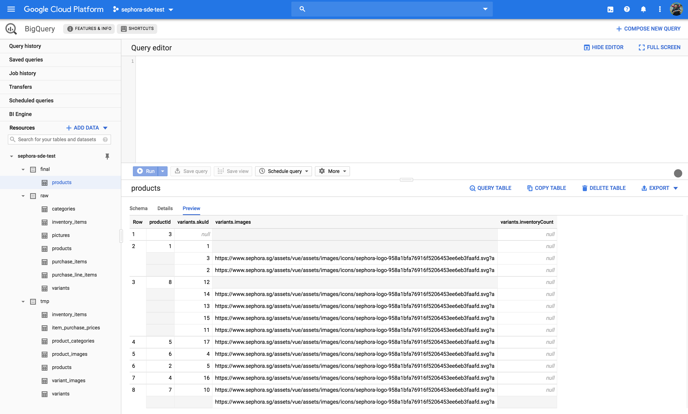
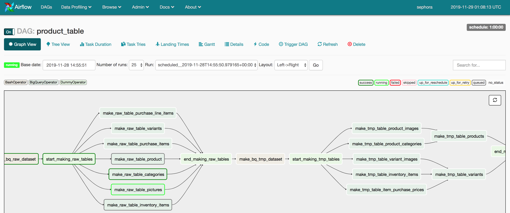
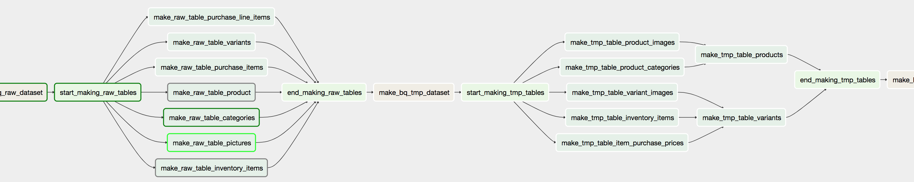
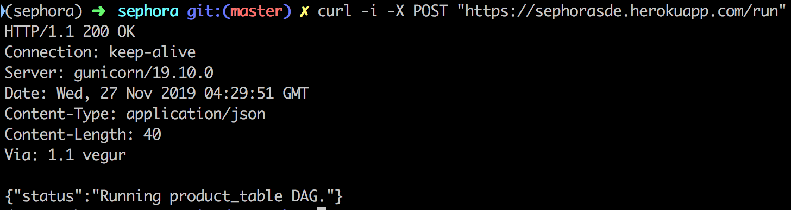
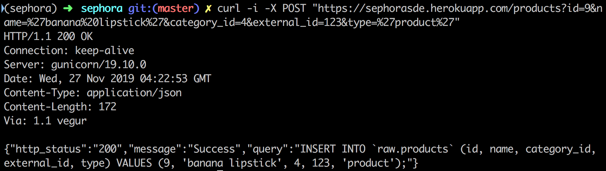
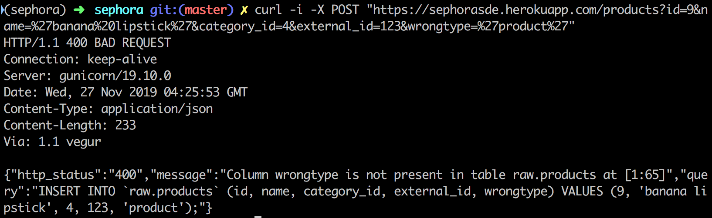

# Sephora Data Engineering Code Test

This repository contains solution that solves the problem statement as mentioned
in [here](https://github.com/devacto/sephora/blob/master/PROBLEM_STATEMENT.md).

### 1. Goals

#### 1.1. BigQuery Table

BigQuery instance can be accessed [here](https://console.cloud.google.com/bigquery?organizationId=316679501295&project=sephora-sde-test).

The goal of this project is to create a `final.product` table in BigQuery from
SQL scripts stored in the raw, tmp, and final folders.

Picture below shows the various datasets in BigQuery.



#### 1.2. Airflow DAG

The execution and dependency management of the script is managed using Airflow. The
Airflow DAG configuration can be found [here](https://github.com/devacto/sephora/blob/master/dags/product.py).

Pictures below shows the resulting DAGs.





Airflow webserver instance can be accessed from [here](https://z797bc688c6f9ca68-tp.appspot.com/admin/).

Dependencies in the `tmp/` folder is managed using [this file](https://github.com/devacto/sephora/blob/master/dags/dependencies.yml).

#### 1.3. API

Code for the API can be found [here](https://github.com/devacto/sephora/blob/master/app.py).

##### /run endpoint

The `/run` endpoint of the public API triggers the running of the DAG on Airflow.

To access this endpoint and try it for yourself, you could run the following command.

```
curl -i -X POST "https://sephorasde.herokuapp.com/run"
```

Picture below shows result when this command is being executed.



##### /<tablename> endpoint

The `/<tablename>` endpoint of the public API will insert records into the table in the `raw` dataset.

To test this endpoint you may run the following command.

```
curl -i -X POST "https://sephorasde.herokuapp.com/products?id=9&name=%27banana%20lipstick%27&category_id=4&external_id=123&type=%27product%27"
```

Picture below shows the result of running this command.



To test this endpoint with the wrong field name you may run the following command.

```
curl -i -X POST "https://sephorasde.herokuapp.com/products?id=9&name=%27banana%20lipstick%27&category_id=4&external_id=123&wrongtype=%27product%27"
```

Picture below shows the result of running this command.



***

### 2. Skills Demonstrated

#### 2.1. Airflow DAG Setup

The DAG script shows building dynamic DAG and parallelising tasks.

The DAG building script will read any SQL files in the `raw`, `tmp`, and `final` folders.

#### 2.2. API Development

The API developed shows suitable status codes.

#### 2.3. Constructing dependencies graph from yaml file.

We have also shown dependencies management using the yaml file. Our dependency management algorithm will also take into account all the files in the `tmp/` folder even if they are not declared in the yaml file.
